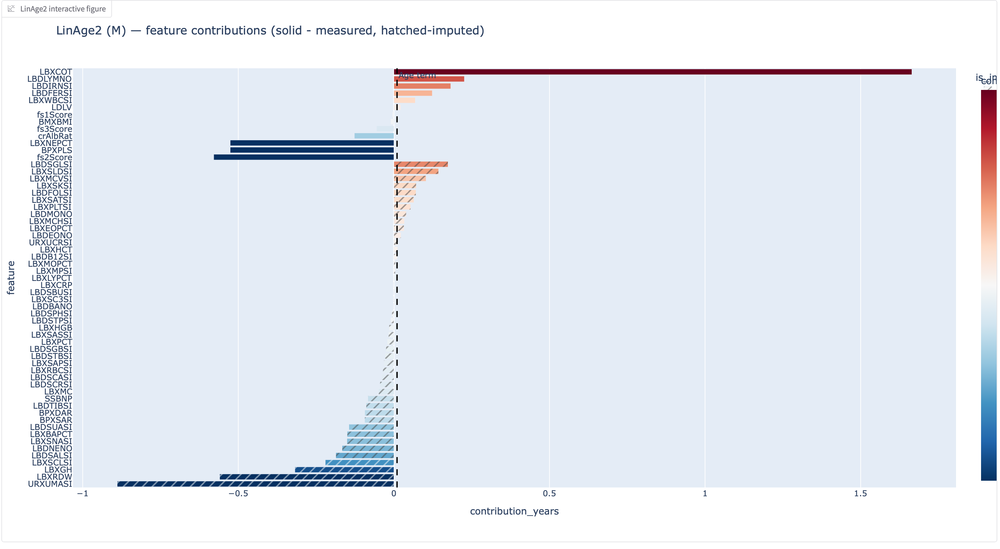

# LinAge2: Clinical Biological Age Clock with Feature Attribution

[](https://doi.org/10.1038/s41514-025-00221-4)


A Python implementation of the **LinAge2** biological age clock with enhanced interpretability and missing data handling. This tool predicts mortality risk and biological age from routine clinical lab measurements, providing **actionable feature-level insights** through linear model decomposition.

---

## 🎯 What is LinAge2?

LinAge2 is a **mortality-predicting aging clock** trained on NHANES data that:
- Estimates biological age (BA) from 57 lab measurements + health questionnaire
- Outperforms chronological age and several epigenetic clocks (PhenoAge DNAm, DunedinPoAm) in predicting 10-20 year mortality
- Uses **principal component analysis + Cox proportional hazards** for interpretable predictions
- Provides **sex-specific models** (separate for males/females)

**Key Reference**: Fong et al. (2025). *LinAge2: providing actionable insights and benchmarking with epigenetic clocks.* npj Aging **11**(29). [DOI: 10.1038/s41514-025-00221-4](https://doi.org/10.1038/s41514-025-00221-4)

---

## ✨ Novel Features (This Implementation)

### 1. **Per-Feature Age Contributions**
Unlike the original R implementation, this version **decomposes the predicted age delta** into contributions from individual lab measurements.

**How it works**:
- LinAge2 is a linear model: `BA = CA + (Z_centered @ w_feature)`
  - `Z_centered`: Lab values normalized to reference cohort (sex/age-matched)
  - `w_feature`: Feature weights derived from Cox model + SVD loadings
- Each lab measurement contributes `±N years` to biological age
- **Visualization**: Interactive Plotly bar chart showing which features "age" (red) or "de-age" (blue) the individual



*Example: Features are sorted by magnitude and grouped by measurement status (measured vs. imputed). Blue bars indicate "younger" contributions (negative age delta), red bars indicate "older" contributions (positive age delta). Hatched bars represent imputed values.*

**Why this matters**:
- Identifies **which lab abnormalities** drive elevated biological age
- Enables **targeted interventions** (e.g., "lowering HbA1c by X would reduce BA by Y years")
- Transparent model behavior (no black-box predictions)

---

### 2. **Missing Data Imputation**
Clinical data is often incomplete. This implementation includes a **sex- and age-stratified imputation** mechanism:

**Algorithm**:
```python
For each missing lab value:
  1. Select reference cohort: same sex, ±5 years age window
  2. Respect 40-year boundary:
     - If age < 40: only use reference subjects aged [age-5, 40)
     - If age ≥ 40: only use reference subjects aged [40, age+5]
  3. Impute with median value from reference cohort
```

**Design rationale**:
- **40-year threshold**: Separates "young/healthy" from "aging" physiology (NHANES training data split)
- **Sex-specific**: Lab normals differ significantly by sex (e.g., hemoglobin, creatinine)
- **Median over mean**: Robust to outliers in reference cohort

**Validation**:
- Imputed values are **visually flagged** in UI (hatched bars in feature contribution chart)
- Users can toggle which measurements are "missing" to explore sensitivity

---

### 3. **Interactive Gradio Web Interface**
- **57 lab measurement sliders** with NHANES code descriptions (e.g., `LBXHGB`: Hemoglobin)
- **Health questionnaire** (comorbidities, self-rated health, healthcare utilization)
- **Bulk controls**: "Mark all Missing" / "Mark all Known" buttons
- **Real-time visualization**: Feature contribution bar chart + age summary

---

## 🚀 Quick Start

### Installation
```bash
# Clone repository
git clone https://github.com/kolya-rjv/linage2.git
cd linage2

# Install dependencies
pip install -r requirements.txt
```

**Dependencies**:
- `gradio` (UI)
- `pandas`, `numpy`, `scikit-survival` (model)
- `plotly` (visualization)
- `joblib` (model artifacts)

### Run the Web Interface
```bash
python ui.py
```

Navigate to `http://localhost:7860` in your browser.

---

## 📊 Sample Workflow

### Step 1: Input Demographics
- **Sex**: Male/Female (required for sex-specific model)
- **Age**: Years (converted to months internally)
- **Participant ID**: Any numeric identifier

### Step 2: Enter Lab Measurements
- Use sliders for available measurements
- Check "Missing" box for unavailable tests → triggers imputation
- Values are in **NHANES SI units** (see [Lab Measurements Reference](#lab-measurements-reference))

### Step 3: Complete Health Questionnaire
- **Comorbidities**: High blood pressure, diabetes, kidney disease, etc. (22 items)
- **Self-rated health**: Excellent → Poor (drives frailty score)
- **Healthcare use**: Number of visits in past year

### Step 4: Interpret Results

**Age Summary**:
```
🧬 Biological Age Summary
- Chronological age: 60.0 y
- Predicted biological age: 68.3 y
- Δ (BA – CA): +8.3 y
```

**Feature Contribution Chart**:
- Bars sorted by magnitude (largest contributors at top)
- **Color**: Red = aging (positive Δ), Blue = de-aging (negative Δ)
- **Pattern**: Solid = measured, Hatched = imputed
- **Groups**: Measured features displayed first, imputed features second
- **Hover**: Shows raw lab value, z-score, weight, and contribution in years

---

## 🧬 Clinical Interpretation

### Understanding BA Delta

| Δ (BA - CA) | Interpretation | Action |
|-------------|---------------|--------|
| **< -5 years** | Biologically younger | Maintain current lifestyle; may inform screening schedules |
| **-5 to +5 years** | Age-appropriate | Continue preventive care |
| **+5 to +15 years** | Accelerated aging | Evaluate modifiable risk factors (see PC analysis) |
| **> +15 years** | High mortality risk | Comprehensive clinical assessment; aggressive intervention |

### Principal Component Insights
Each bar represents a feature's contribution, but features are grouped by underlying **principal components** (PCs):

- **PC1M (Males) / PC1F (Females)**: Cardiometabolic syndrome
  - High contributors: HbA1c, BMI, triglycerides, blood pressure
  - **Intervention**: Weight loss, glycemic control, lipid management
  
- **PC2-PC4**: Kidney function, inflammation, anemia
  - See [paper Supplementary Table 5](https://doi.org/10.1038/s41514-025-00221-4) for full PC→mechanism mapping

---

## 📋 Lab Measurements Reference

### Required Inputs (57 Total)

<details>
<summary><b>Click to expand full list</b></summary>

| NHANES Code | Description | Units | Normal Range* |
|-------------|-------------|-------|---------------|
| **Vitals** |||
| `BPXPLS` | Pulse rate | beats/min | 60-100 |
| `BPXSAR` | Systolic BP (avg) | mmHg | 90-120 |
| `BPXDAR` | Diastolic BP (avg) | mmHg | 60-80 |
| `BMXBMI` | Body mass index | kg/m² | 18.5-24.9 |
| **Complete Blood Count** |||
| `LBXWBCSI` | White blood cells | ×10⁹/L | 4.5-11.0 |
| `LBXRBCSI` | Red blood cells | ×10¹²/L | M: 4.7-6.1, F: 4.2-5.4 |
| `LBXHGB` | Hemoglobin | g/dL | M: 13.5-17.5, F: 12.0-15.5 |
| `LBXHCT` | Hematocrit | % | M: 38.3-48.6, F: 35.5-44.9 |
| `LBXPLTSI` | Platelets | ×10⁹/L | 150-400 |
| **Chemistry Panel** |||
| `LBDSGLSI` | Glucose | mmol/L | 3.9-5.6 (fasting) |
| `LBXGH` | HbA1c | % | <5.7 |
| `LBDSCRSI` | Creatinine | µmol/L | M: 62-106, F: 44-80 |
| `LBDSBUSI` | Blood urea nitrogen | mmol/L | 2.5-7.1 |
| `LBXSNASI` | Sodium | mmol/L | 136-145 |
| `LBXSKSI` | Potassium | mmol/L | 3.5-5.0 |
| **Inflammation** |||
| `LBXCRP` | C-reactive protein | mg/L | <3.0 |
| `SSBNP` | NT-proBNP | pg/mL | <125 |
| **Lipids** (derived) |||
| `LDLV` | LDL cholesterol (calculated) | mmol/L | <3.4 |
| ... | *(see `ui_sliders.py` for complete list)* | | |

\* Ranges are approximate; clinical context required

</details>

**Units**: All measurements use **NHANES SI units**. The UI displays these in slider labels.

**Fasting requirements**: Glucose, lipid panel should be fasting (8-12 hours). Model does not enforce this but predictions may be less accurate with non-fasting values.

---

## 🔬 Model Architecture

### Training Data
- **Cohort**: NHANES 1999-2000 (training), 2001-2002 (validation)
- **Inclusion**: Ages 40-85, excluding accidental deaths
- **Sample size**: ~2,000 subjects per wave

### Pipeline
```
Input Labs (57 features)
    ↓
Box-Cox Transform (parameter-specific λ)
    ↓
Z-Score Normalization (sex-specific, median/MAD, ref: ages 40-50)
    ↓
Outlier Folding (cap at ±6σ)
    ↓
SVD Projection → 59 Principal Components (sex-specific)
    ↓
Cox Proportional Hazards Model (age + PC1-PC59)
    ↓
Biological Age = CA + Σ(PC_i × β_i) / β_age
```


### Performance (from Paper)
| Metric | LinAge2 | PhenoAge Clinical | GrimAge2 | DunedinPoAm |
|--------|---------|-------------------|----------|-------------|
| **20-year mortality AUC** | **0.844** | 0.848 | 0.823 | 0.786 |
| **10-year mortality AUC** | **0.868** | 0.848 | 0.852 | 0.827 |
| **Healthspan correlation** | ✓ | ✓ | ✓ | ✓ |

---

## 📞 Contact

**Questions about the model**: See paper or contact authors at [kolya.russkikh@rejuve.ai](mailto:kolya.russkikh@rejuve.ai)  
**Implementation issues**: Open a GitHub issue

---

## 🙏 Acknowledgments

- NHANES participants and staff
- Original LinAge2 authors (Fong et al., 2025)
- `scikit-survival` library for Cox model implementation
